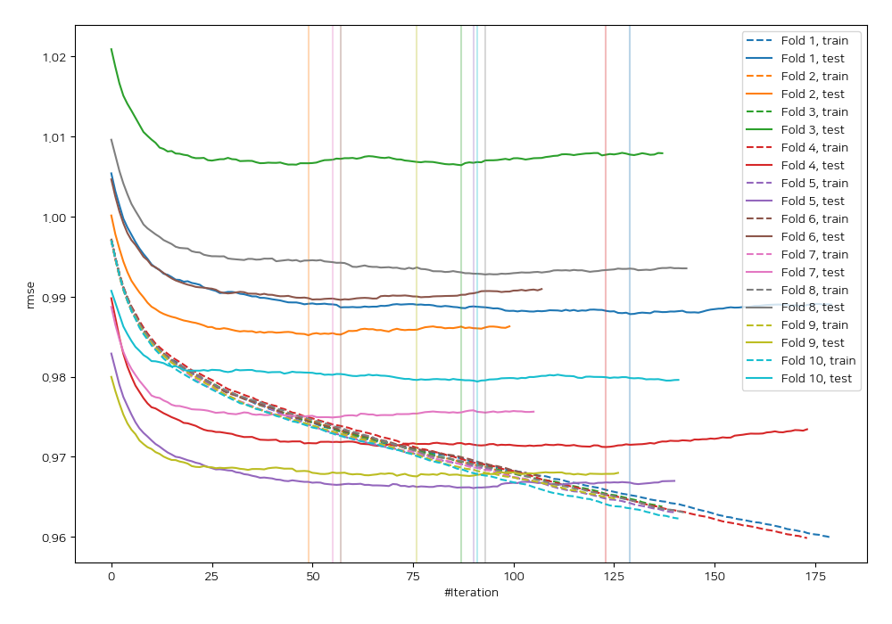
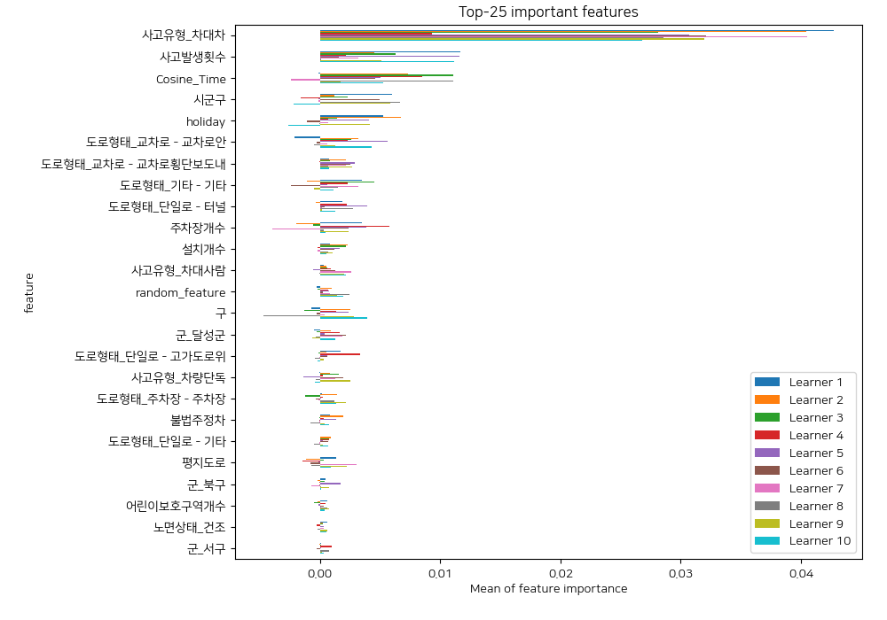
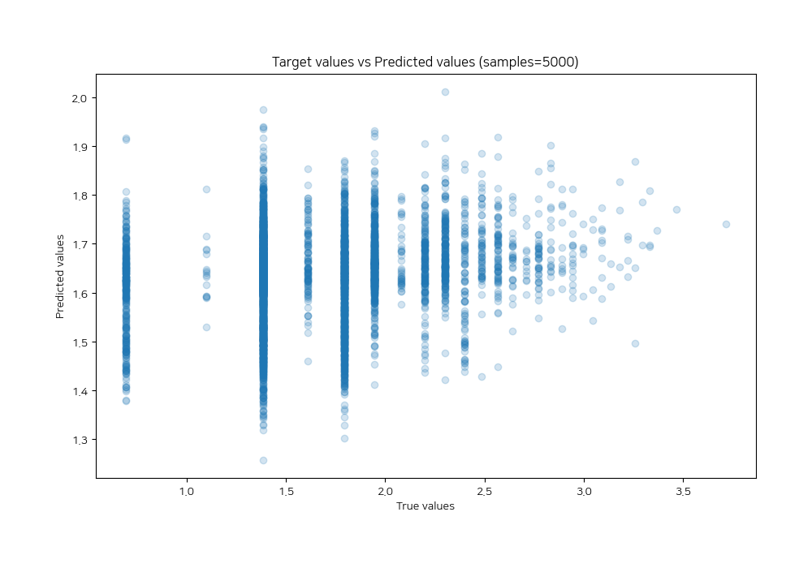
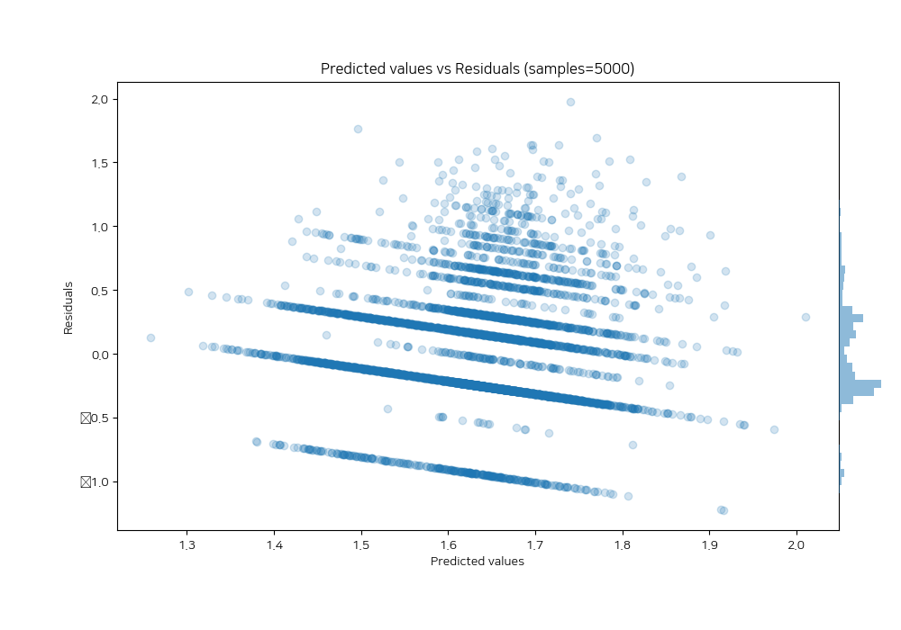

# Summary of 10_Xgboost_categorical_mix_RandomFeature

[<< Go back](../README.md)

## Extreme Gradient Boosting (Xgboost)
- **n_jobs**: -1
- **objective**: reg:squarederror
- **eta**: 0.1
- **max_depth**: 4
- **min_child_weight**: 25
- **subsample**: 0.7
- **colsample_bytree**: 0.7
- **eval_metric**: rmse
- **explain_level**: 1

## Validation
 - **validation_type**: kfold
 - **shuffle**: True
 - **k_folds**: 10

## Optimized metric
rmse

## Training time

39.1 seconds

### Metric details:
| Metric   |     Score |
|:---------|----------:|
| MAE      | 0.352671  |
| MSE      | 0.197826  |
| RMSE     | 0.444776  |
| R2       | 0.0354046 |
| MAPE     | 0.250013  |

## Learning curves

## Permutation-based Importance

## True vs Predicted

## Predicted vs Residuals

[<< Go back](../README.md)
