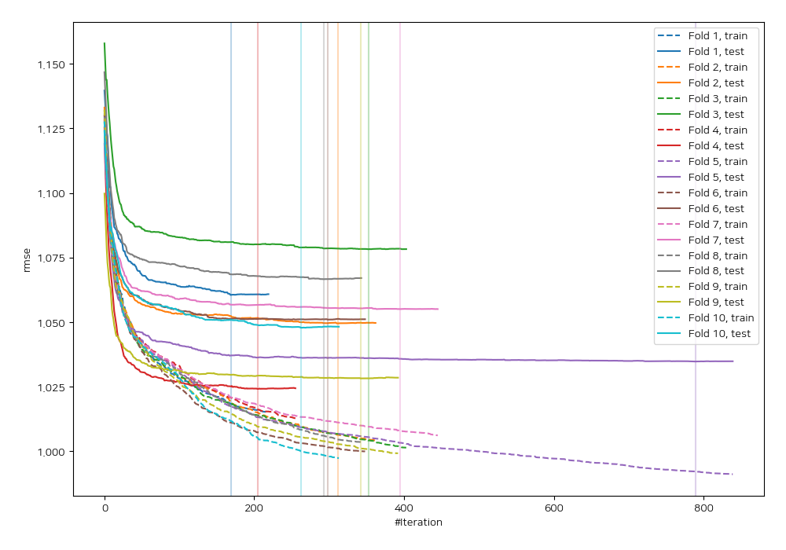
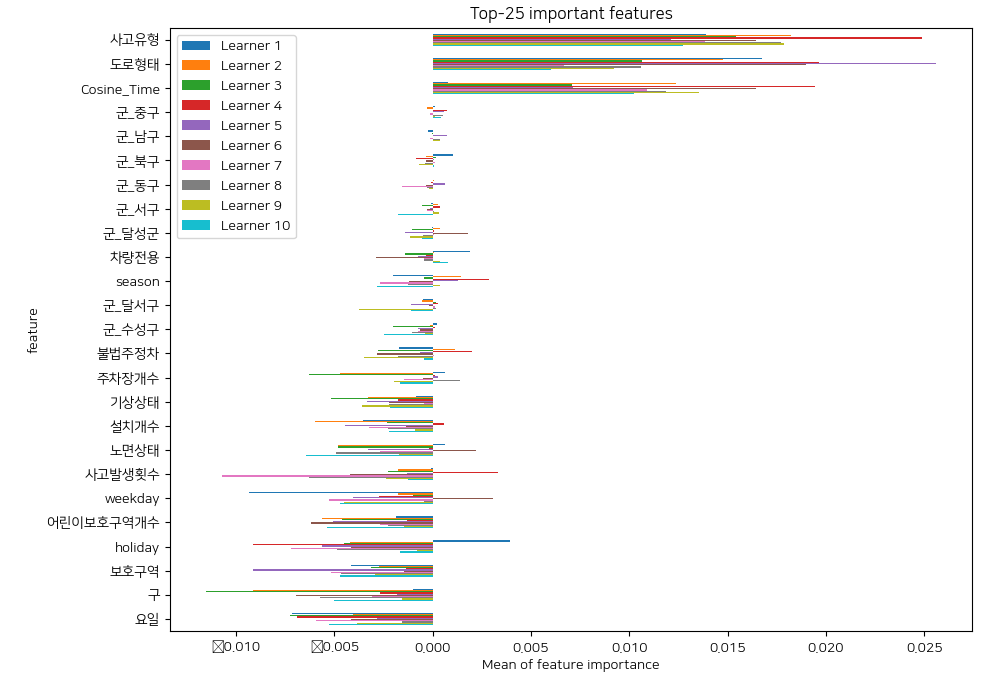
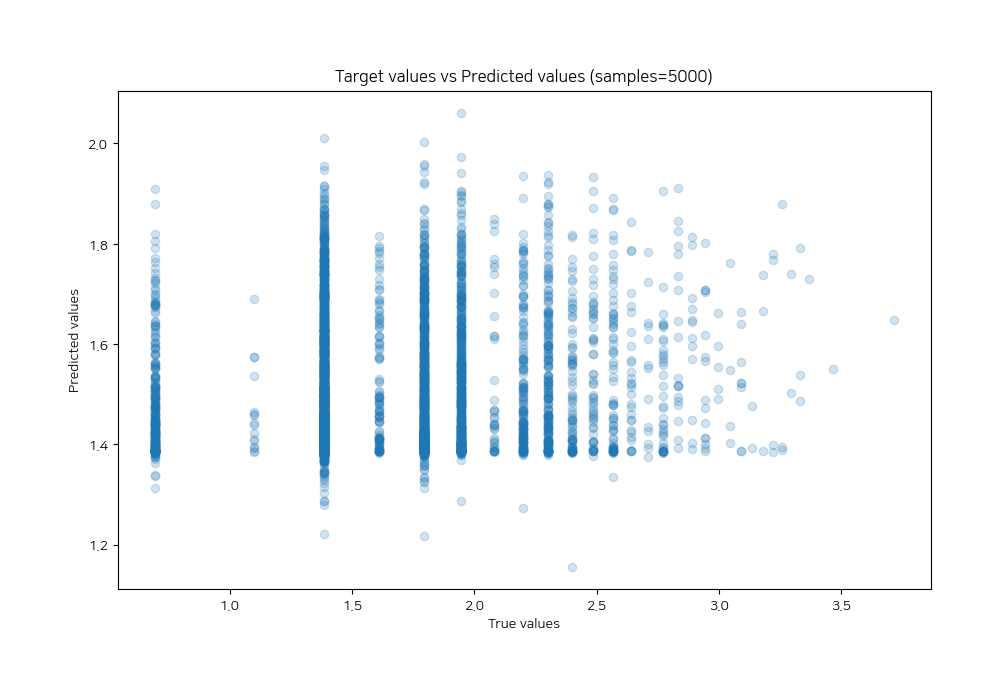
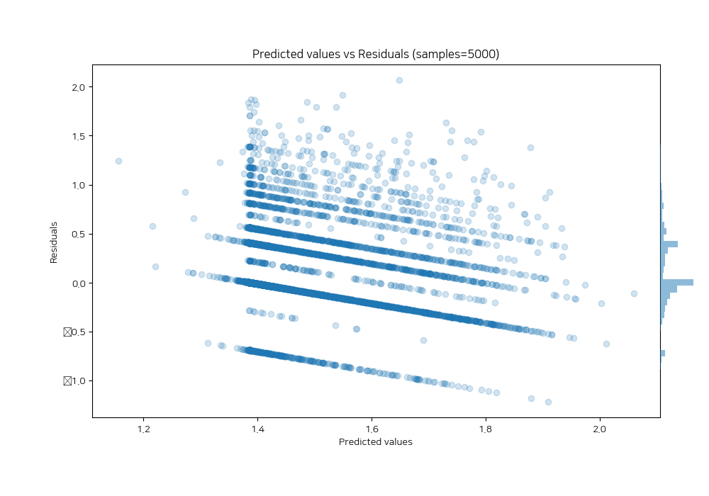

# Summary of 24_CatBoost

[<< Go back](../README.md)

## CatBoost
- **n_jobs**: -1
- **learning_rate**: 0.1
- **depth**: 8
- **rsm**: 1.0
- **loss_function**: MAE
- **eval_metric**: RMSE
- **explain_level**: 2

## Validation
 - **validation_type**: kfold
 - **shuffle**: True
 - **k_folds**: 10

## Optimized metric
rmse

## Training time

361.4 seconds

### Metric details:
| Metric   |     Score |
|:---------|----------:|
| MAE      |  0.338263 |
| MSE      |  0.225921 |
| RMSE     |  0.475312 |
| R2       | -0.10159  |
| MAPE     |  0.220181 |

## Learning curves

## Permutation-based Importance

## True vs Predicted

## Predicted vs Residuals

[<< Go back](../README.md)
