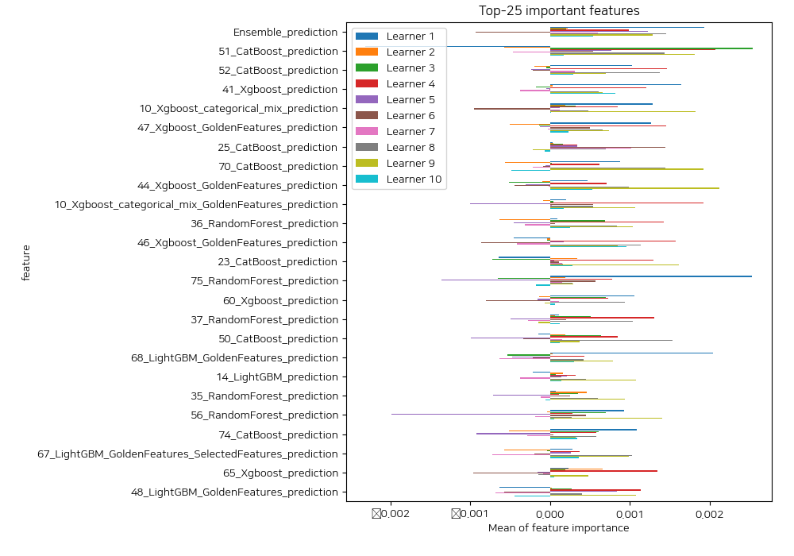
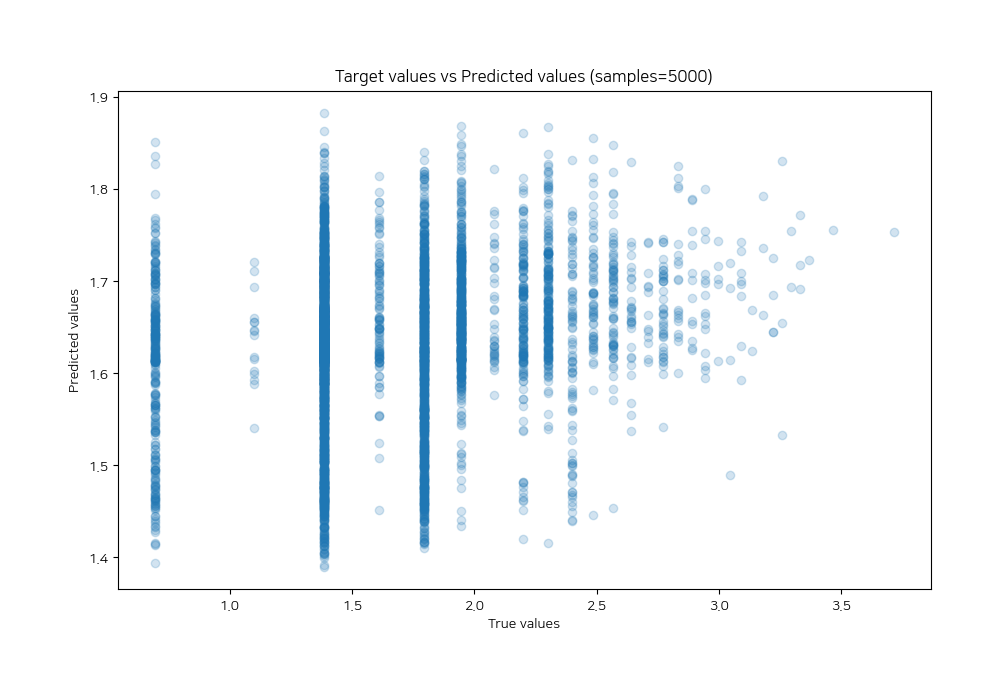
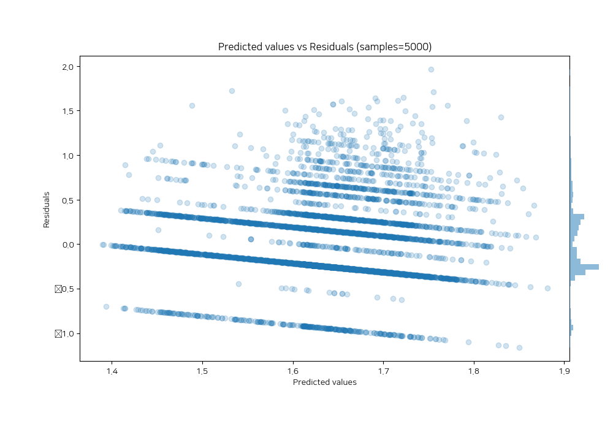

# Summary of 50_CatBoost_Stacked

[<< Go back](../README.md)

## CatBoost
- **n_jobs**: -1
- **learning_rate**: 0.025
- **depth**: 8
- **rsm**: 0.8
- **loss_function**: RMSE
- **eval_metric**: RMSE
- **explain_level**: 2

## Validation
 - **validation_type**: kfold
 - **shuffle**: True
 - **k_folds**: 10

## Optimized metric
rmse

## Training time

208.0 seconds

### Metric details:
| Metric   |     Score |
|:---------|----------:|
| MAE      | 0.352824  |
| MSE      | 0.197695  |
| RMSE     | 0.444629  |
| R2       | 0.0360422 |
| MAPE     | 0.250191  |

## Learning curves

## Permutation-based Importance

## True vs Predicted

## Predicted vs Residuals

[<< Go back](../README.md)
