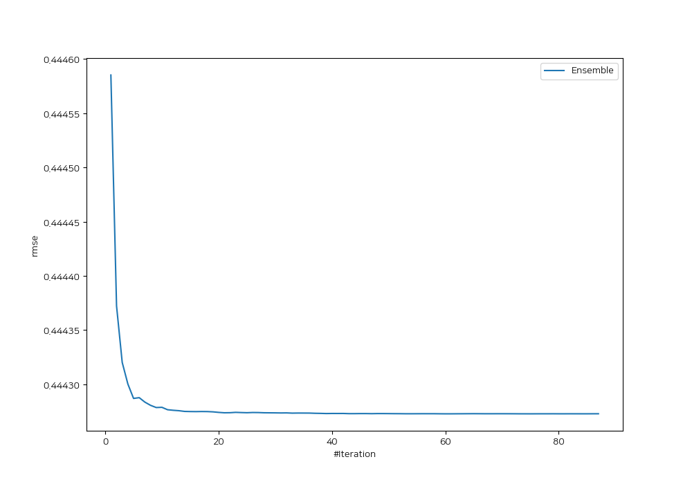
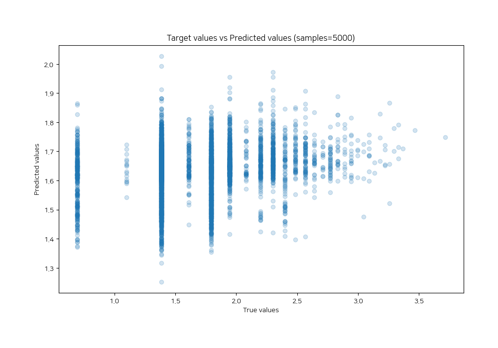
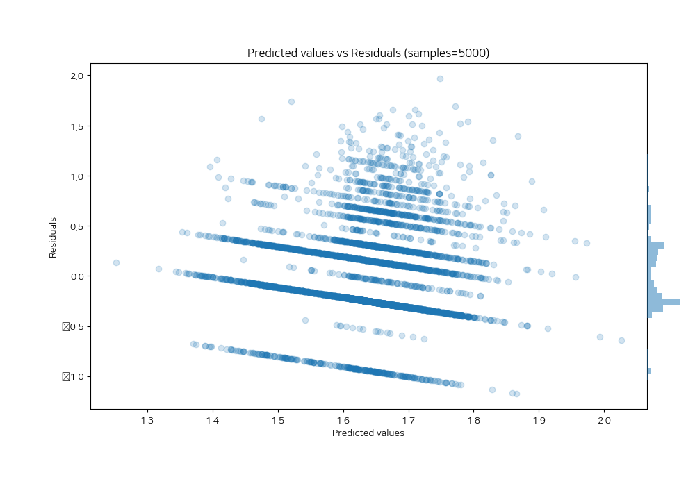

# Summary of Ensemble

[<< Go back](../README.md)

## Ensemble structure
| Model                                       |   Weight |
|:--------------------------------------------|---------:|
| 10_Xgboost_KMeansFeatures                   |        1 |
| 12_Xgboost                                  |        1 |
| 41_Xgboost                                  |       11 |
| 45_LightGBM_GoldenFeatures_SelectedFeatures |        4 |
| 46_Xgboost_GoldenFeatures                   |       14 |
| 51_CatBoost                                 |        7 |
| 53_CatBoost                                 |        1 |
| 61_Xgboost                                  |       10 |
| 64_LightGBM_GoldenFeatures_SelectedFeatures |       14 |
| 66_Xgboost                                  |        6 |
| 74_CatBoost                                 |        2 |
| 7_Xgboost                                   |        4 |

### Metric details:
| Metric   |     Score |
|:---------|----------:|
| MAE      | 0.352567  |
| MSE      | 0.197378  |
| RMSE     | 0.444273  |
| R2       | 0.0375851 |
| MAPE     | 0.24996   |

## Learning curves

## True vs Predicted

## Predicted vs Residuals

[<< Go back](../README.md)
