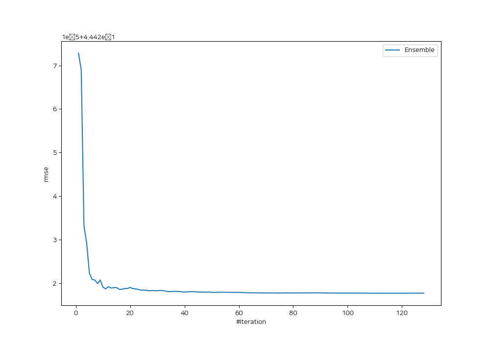
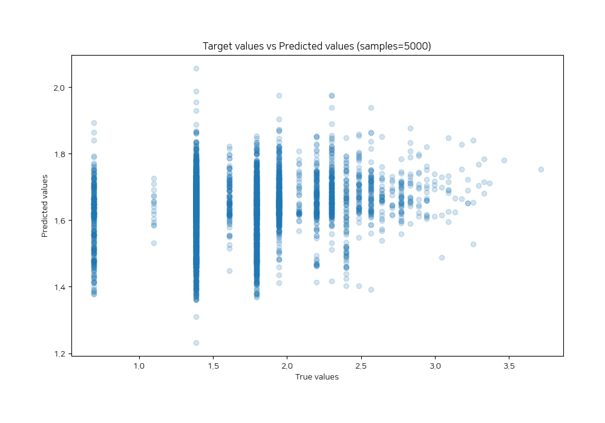
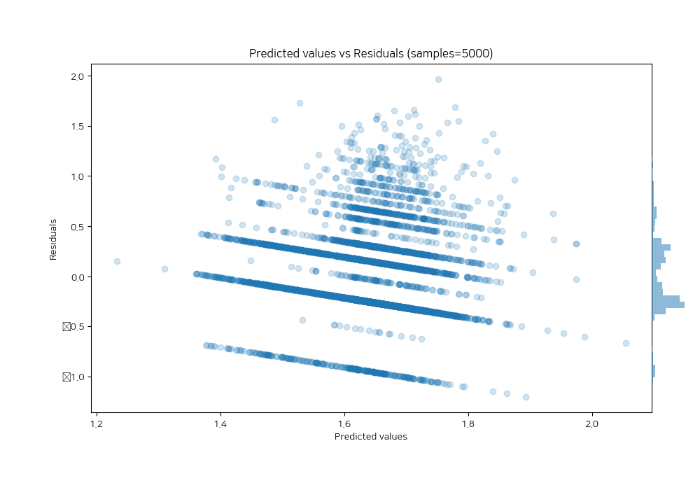

# Summary of Ensemble_Stacked

[<< Go back](../README.md)

## Ensemble structure
| Model                                       |   Weight |
|:--------------------------------------------|---------:|
| 10_Xgboost_KMeansFeatures                   |        2 |
| 36_RandomForest_Stacked                     |       20 |
| 40_RandomForest_Stacked                     |        9 |
| 41_Xgboost                                  |        2 |
| 46_Xgboost_GoldenFeatures                   |        6 |
| 51_CatBoost                                 |        2 |
| 56_RandomForest_Stacked                     |       14 |
| 61_Xgboost                                  |        5 |
| 64_LightGBM_GoldenFeatures_SelectedFeatures |        3 |
| 7_Xgboost                                   |        2 |
| Ensemble                                    |       49 |

### Metric details:
| Metric   |     Score |
|:---------|----------:|
| MAE      | 0.352364  |
| MSE      | 0.197329  |
| RMSE     | 0.444218  |
| R2       | 0.0378239 |
| MAPE     | 0.249798  |

## Learning curves

## True vs Predicted

## Predicted vs Residuals

[<< Go back](../README.md)
