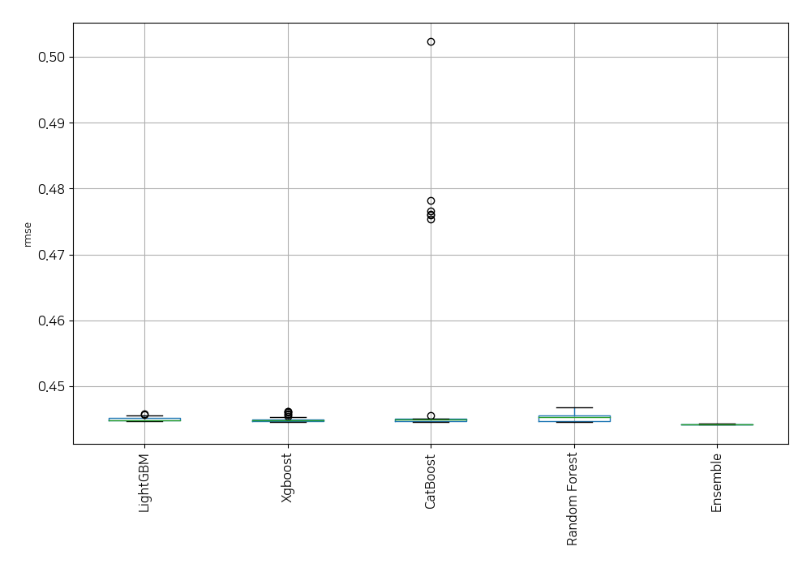
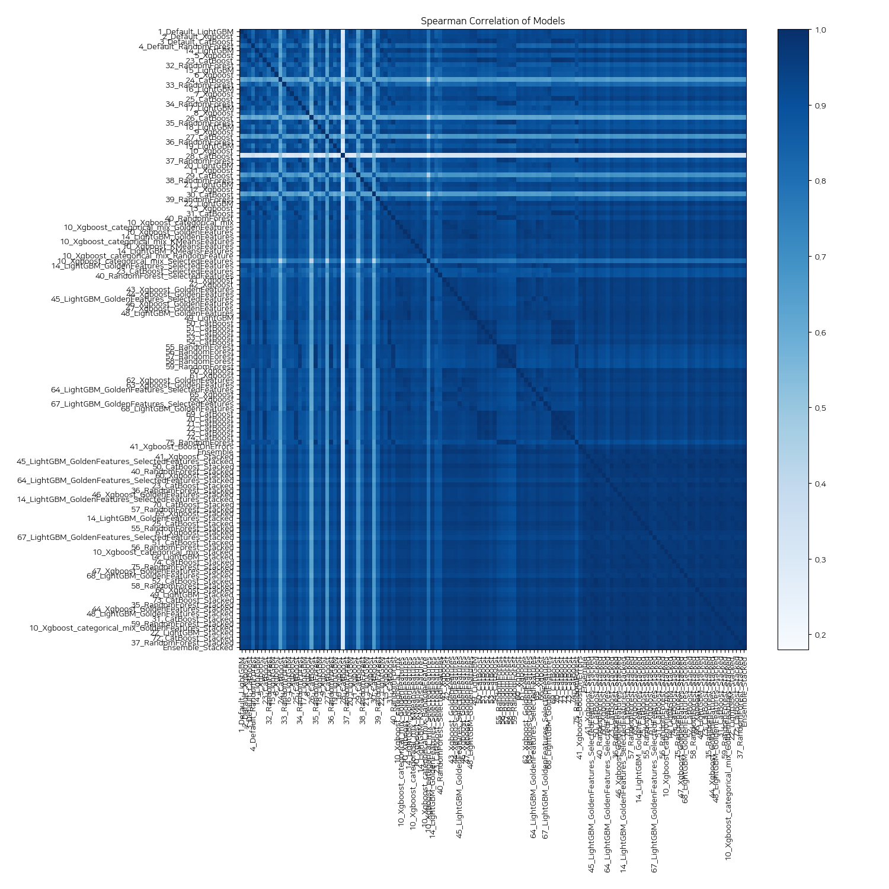

# AutoML Leaderboard

| Best model   | name                                                                                                                 | model_type    | metric_type   |   metric_value |   train_time |
|:-------------|:---------------------------------------------------------------------------------------------------------------------|:--------------|:--------------|---------------:|-------------:|
|              | [1_Default_LightGBM](1_Default_LightGBM/README.md)                                                                   | LightGBM      | rmse          |       0.445332 |        45.4  |
|              | [2_Default_Xgboost](2_Default_Xgboost/README.md)                                                                     | Xgboost       | rmse          |       0.445259 |        41.9  |
|              | [3_Default_CatBoost](3_Default_CatBoost/README.md)                                                                   | CatBoost      | rmse          |       0.444973 |       147.5  |
|              | [4_Default_RandomForest](4_Default_RandomForest/README.md)                                                           | Random Forest | rmse          |       0.446177 |       222.74 |
|              | [14_LightGBM](14_LightGBM/README.md)                                                                                 | LightGBM      | rmse          |       0.444774 |        42.06 |
|              | [5_Xgboost](5_Xgboost/README.md)                                                                                     | Xgboost       | rmse          |       0.446021 |        40.08 |
|              | [23_CatBoost](23_CatBoost/README.md)                                                                                 | CatBoost      | rmse          |       0.444857 |       268.39 |
|              | [32_RandomForest](32_RandomForest/README.md)                                                                         | Random Forest | rmse          |       0.446239 |       223.01 |
|              | [15_LightGBM](15_LightGBM/README.md)                                                                                 | LightGBM      | rmse          |       0.445794 |        35.45 |
|              | [6_Xgboost](6_Xgboost/README.md)                                                                                     | Xgboost       | rmse          |       0.446184 |        42.91 |
|              | [24_CatBoost](24_CatBoost/README.md)                                                                                 | CatBoost      | rmse          |       0.475312 |       363.84 |
|              | [33_RandomForest](33_RandomForest/README.md)                                                                         | Random Forest | rmse          |       0.446749 |       172.69 |
|              | [16_LightGBM](16_LightGBM/README.md)                                                                                 | LightGBM      | rmse          |       0.445187 |        36.31 |
|              | [7_Xgboost](7_Xgboost/README.md)                                                                                     | Xgboost       | rmse          |       0.445133 |        32.88 |
|              | [25_CatBoost](25_CatBoost/README.md)                                                                                 | CatBoost      | rmse          |       0.444873 |       169.45 |
|              | [34_RandomForest](34_RandomForest/README.md)                                                                         | Random Forest | rmse          |       0.445595 |       205.25 |
|              | [17_LightGBM](17_LightGBM/README.md)                                                                                 | LightGBM      | rmse          |       0.445599 |        37.91 |
|              | [8_Xgboost](8_Xgboost/README.md)                                                                                     | Xgboost       | rmse          |       0.445856 |        37.26 |
|              | [26_CatBoost](26_CatBoost/README.md)                                                                                 | CatBoost      | rmse          |       0.476015 |       194.62 |
|              | [35_RandomForest](35_RandomForest/README.md)                                                                         | Random Forest | rmse          |       0.445426 |       202.13 |
|              | [18_LightGBM](18_LightGBM/README.md)                                                                                 | LightGBM      | rmse          |       0.44573  |        30.49 |
|              | [9_Xgboost](9_Xgboost/README.md)                                                                                     | Xgboost       | rmse          |       0.444827 |        34.3  |
|              | [27_CatBoost](27_CatBoost/README.md)                                                                                 | CatBoost      | rmse          |       0.478221 |       261.93 |
|              | [36_RandomForest](36_RandomForest/README.md)                                                                         | Random Forest | rmse          |       0.445264 |       266.21 |
|              | [19_LightGBM](19_LightGBM/README.md)                                                                                 | LightGBM      | rmse          |       0.445498 |        41.28 |
|              | [10_Xgboost](10_Xgboost/README.md)                                                                                   | Xgboost       | rmse          |       0.444739 |        31.25 |
|              | [28_CatBoost](28_CatBoost/README.md)                                                                                 | CatBoost      | rmse          |       0.502276 |       276.88 |
|              | [37_RandomForest](37_RandomForest/README.md)                                                                         | Random Forest | rmse          |       0.445476 |       287.54 |
|              | [20_LightGBM](20_LightGBM/README.md)                                                                                 | LightGBM      | rmse          |       0.445149 |        37.02 |
|              | [11_Xgboost](11_Xgboost/README.md)                                                                                   | Xgboost       | rmse          |       0.445654 |        39.25 |
|              | [29_CatBoost](29_CatBoost/README.md)                                                                                 | CatBoost      | rmse          |       0.476588 |       723.76 |
|              | [38_RandomForest](38_RandomForest/README.md)                                                                         | Random Forest | rmse          |       0.446021 |       141.33 |
|              | [21_LightGBM](21_LightGBM/README.md)                                                                                 | LightGBM      | rmse          |       0.445341 |        30.27 |
|              | [12_Xgboost](12_Xgboost/README.md)                                                                                   | Xgboost       | rmse          |       0.445128 |        31.72 |
|              | [30_CatBoost](30_CatBoost/README.md)                                                                                 | CatBoost      | rmse          |       0.476079 |       353.37 |
|              | [39_RandomForest](39_RandomForest/README.md)                                                                         | Random Forest | rmse          |       0.446012 |       142.2  |
|              | [22_LightGBM](22_LightGBM/README.md)                                                                                 | LightGBM      | rmse          |       0.444848 |        37.68 |
|              | [13_Xgboost](13_Xgboost/README.md)                                                                                   | Xgboost       | rmse          |       0.445423 |        38.33 |
|              | [31_CatBoost](31_CatBoost/README.md)                                                                                 | CatBoost      | rmse          |       0.444924 |       332.2  |
|              | [40_RandomForest](40_RandomForest/README.md)                                                                         | Random Forest | rmse          |       0.445242 |       197.48 |
|              | [10_Xgboost_categorical_mix](10_Xgboost_categorical_mix/README.md)                                                   | Xgboost       | rmse          |       0.444697 |        46.16 |
|              | [10_Xgboost_categorical_mix_GoldenFeatures](10_Xgboost_categorical_mix_GoldenFeatures/README.md)                     | Xgboost       | rmse          |       0.44471  |        45.37 |
|              | [10_Xgboost_GoldenFeatures](10_Xgboost_GoldenFeatures/README.md)                                                     | Xgboost       | rmse          |       0.444718 |        41.95 |
|              | [14_LightGBM_GoldenFeatures](14_LightGBM_GoldenFeatures/README.md)                                                   | LightGBM      | rmse          |       0.444744 |        48.65 |
|              | [10_Xgboost_categorical_mix_KMeansFeatures](10_Xgboost_categorical_mix_KMeansFeatures/README.md)                     | Xgboost       | rmse          |       0.444948 |        55.97 |
|              | [10_Xgboost_KMeansFeatures](10_Xgboost_KMeansFeatures/README.md)                                                     | Xgboost       | rmse          |       0.444955 |        56.32 |
|              | [14_LightGBM_KMeansFeatures](14_LightGBM_KMeansFeatures/README.md)                                                   | LightGBM      | rmse          |       0.444876 |        63.92 |
|              | [10_Xgboost_categorical_mix_RandomFeature](10_Xgboost_categorical_mix_RandomFeature/README.md)                       | Xgboost       | rmse          |       0.444776 |        41.42 |
|              | [10_Xgboost_categorical_mix_SelectedFeatures](10_Xgboost_categorical_mix_SelectedFeatures/README.md)                 | Xgboost       | rmse          |       0.446151 |        21.23 |
|              | [14_LightGBM_GoldenFeatures_SelectedFeatures](14_LightGBM_GoldenFeatures_SelectedFeatures/README.md)                 | LightGBM      | rmse          |       0.444711 |        33.67 |
|              | [23_CatBoost_SelectedFeatures](23_CatBoost_SelectedFeatures/README.md)                                               | CatBoost      | rmse          |       0.445534 |       161.58 |
|              | [40_RandomForest_SelectedFeatures](40_RandomForest_SelectedFeatures/README.md)                                       | Random Forest | rmse          |       0.445582 |       121.77 |
|              | [41_Xgboost](41_Xgboost/README.md)                                                                                   | Xgboost       | rmse          |       0.444585 |        41.34 |
|              | [42_Xgboost](42_Xgboost/README.md)                                                                                   | Xgboost       | rmse          |       0.444782 |        39.95 |
|              | [43_Xgboost_GoldenFeatures](43_Xgboost_GoldenFeatures/README.md)                                                     | Xgboost       | rmse          |       0.444836 |        44.95 |
|              | [44_Xgboost_GoldenFeatures](44_Xgboost_GoldenFeatures/README.md)                                                     | Xgboost       | rmse          |       0.444707 |        44.82 |
|              | [45_LightGBM_GoldenFeatures_SelectedFeatures](45_LightGBM_GoldenFeatures_SelectedFeatures/README.md)                 | LightGBM      | rmse          |       0.444662 |        34.52 |
|              | [46_Xgboost_GoldenFeatures](46_Xgboost_GoldenFeatures/README.md)                                                     | Xgboost       | rmse          |       0.444611 |        44.27 |
|              | [47_Xgboost_GoldenFeatures](47_Xgboost_GoldenFeatures/README.md)                                                     | Xgboost       | rmse          |       0.444699 |        41.34 |
|              | [48_LightGBM_GoldenFeatures](48_LightGBM_GoldenFeatures/README.md)                                                   | LightGBM      | rmse          |       0.444839 |        49.11 |
|              | [49_LightGBM](49_LightGBM/README.md)                                                                                 | LightGBM      | rmse          |       0.444807 |        38.91 |
|              | [50_CatBoost](50_CatBoost/README.md)                                                                                 | CatBoost      | rmse          |       0.444823 |       408.35 |
|              | [51_CatBoost](51_CatBoost/README.md)                                                                                 | CatBoost      | rmse          |       0.444875 |       155.58 |
|              | [52_CatBoost](52_CatBoost/README.md)                                                                                 | CatBoost      | rmse          |       0.444896 |       232.96 |
|              | [53_CatBoost](53_CatBoost/README.md)                                                                                 | CatBoost      | rmse          |       0.445021 |       110.83 |
|              | [54_CatBoost](54_CatBoost/README.md)                                                                                 | CatBoost      | rmse          |       0.445006 |       205.86 |
|              | [55_RandomForest](55_RandomForest/README.md)                                                                         | Random Forest | rmse          |       0.44528  |       293.72 |
|              | [56_RandomForest](56_RandomForest/README.md)                                                                         | Random Forest | rmse          |       0.445312 |       185.42 |
|              | [57_RandomForest](57_RandomForest/README.md)                                                                         | Random Forest | rmse          |       0.445275 |       291.37 |
|              | [58_RandomForest](58_RandomForest/README.md)                                                                         | Random Forest | rmse          |       0.445385 |       162.65 |
|              | [59_RandomForest](59_RandomForest/README.md)                                                                         | Random Forest | rmse          |       0.445454 |       274.76 |
|              | [60_Xgboost](60_Xgboost/README.md)                                                                                   | Xgboost       | rmse          |       0.444594 |        44.14 |
|              | [61_Xgboost](61_Xgboost/README.md)                                                                                   | Xgboost       | rmse          |       0.444666 |        40.22 |
|              | [62_Xgboost_GoldenFeatures](62_Xgboost_GoldenFeatures/README.md)                                                     | Xgboost       | rmse          |       0.444715 |        45.51 |
|              | [63_Xgboost_GoldenFeatures](63_Xgboost_GoldenFeatures/README.md)                                                     | Xgboost       | rmse          |       0.444778 |        45.77 |
|              | [64_LightGBM_GoldenFeatures_SelectedFeatures](64_LightGBM_GoldenFeatures_SelectedFeatures/README.md)                 | LightGBM      | rmse          |       0.444699 |        34.97 |
|              | [65_Xgboost](65_Xgboost/README.md)                                                                                   | Xgboost       | rmse          |       0.444623 |        43.68 |
|              | [66_Xgboost](66_Xgboost/README.md)                                                                                   | Xgboost       | rmse          |       0.444705 |        40.02 |
|              | [67_LightGBM_GoldenFeatures_SelectedFeatures](67_LightGBM_GoldenFeatures_SelectedFeatures/README.md)                 | LightGBM      | rmse          |       0.444767 |        34.5  |
|              | [68_LightGBM_GoldenFeatures](68_LightGBM_GoldenFeatures/README.md)                                                   | LightGBM      | rmse          |       0.444801 |        51.99 |
|              | [69_CatBoost](69_CatBoost/README.md)                                                                                 | CatBoost      | rmse          |       0.444945 |       359.78 |
|              | [70_CatBoost](70_CatBoost/README.md)                                                                                 | CatBoost      | rmse          |       0.444867 |       426.13 |
|              | [71_CatBoost](71_CatBoost/README.md)                                                                                 | CatBoost      | rmse          |       0.444961 |       230.27 |
|              | [72_CatBoost](72_CatBoost/README.md)                                                                                 | CatBoost      | rmse          |       0.444929 |       265.09 |
|              | [73_CatBoost](73_CatBoost/README.md)                                                                                 | CatBoost      | rmse          |       0.444915 |       146.7  |
|              | [74_CatBoost](74_CatBoost/README.md)                                                                                 | CatBoost      | rmse          |       0.444894 |       179.37 |
|              | [75_RandomForest](75_RandomForest/README.md)                                                                         | Random Forest | rmse          |       0.445339 |       248.04 |
|              | [41_Xgboost_BoostOnErrors](41_Xgboost_BoostOnErrors/README.md)                                                       | Xgboost       | rmse          |       0.444888 |        41.66 |
|              | [Ensemble](Ensemble/README.md)                                                                                       | Ensemble      | rmse          |       0.444273 |        31.21 |
|              | [41_Xgboost_Stacked](41_Xgboost_Stacked/README.md)                                                                   | Xgboost       | rmse          |       0.444943 |        61.61 |
|              | [45_LightGBM_GoldenFeatures_SelectedFeatures_Stacked](45_LightGBM_GoldenFeatures_SelectedFeatures_Stacked/README.md) | LightGBM      | rmse          |       0.444782 |        41.95 |
|              | [50_CatBoost_Stacked](50_CatBoost_Stacked/README.md)                                                                 | CatBoost      | rmse          |       0.444629 |       210.41 |
|              | [40_RandomForest_Stacked](40_RandomForest_Stacked/README.md)                                                         | Random Forest | rmse          |       0.444542 |       816.54 |
|              | [60_Xgboost_Stacked](60_Xgboost_Stacked/README.md)                                                                   | Xgboost       | rmse          |       0.444864 |        62.98 |
|              | [64_LightGBM_GoldenFeatures_SelectedFeatures_Stacked](64_LightGBM_GoldenFeatures_SelectedFeatures_Stacked/README.md) | LightGBM      | rmse          |       0.444967 |        44.66 |
|              | [23_CatBoost_Stacked](23_CatBoost_Stacked/README.md)                                                                 | CatBoost      | rmse          |       0.444639 |       159.6  |
|              | [36_RandomForest_Stacked](36_RandomForest_Stacked/README.md)                                                         | Random Forest | rmse          |       0.444598 |      1048.61 |
|              | [46_Xgboost_GoldenFeatures_Stacked](46_Xgboost_GoldenFeatures_Stacked/README.md)                                     | Xgboost       | rmse          |       0.44487  |        51    |
|              | [14_LightGBM_GoldenFeatures_SelectedFeatures_Stacked](14_LightGBM_GoldenFeatures_SelectedFeatures_Stacked/README.md) | LightGBM      | rmse          |       0.444839 |        43    |
|              | [70_CatBoost_Stacked](70_CatBoost_Stacked/README.md)                                                                 | CatBoost      | rmse          |       0.444647 |       262.27 |
|              | [57_RandomForest_Stacked](57_RandomForest_Stacked/README.md)                                                         | Random Forest | rmse          |       0.444631 |      1033.92 |
|              | [65_Xgboost_Stacked](65_Xgboost_Stacked/README.md)                                                                   | Xgboost       | rmse          |       0.444859 |        63.22 |
|              | [14_LightGBM_GoldenFeatures_Stacked](14_LightGBM_GoldenFeatures_Stacked/README.md)                                   | LightGBM      | rmse          |       0.444815 |        53.42 |
|              | [25_CatBoost_Stacked](25_CatBoost_Stacked/README.md)                                                                 | CatBoost      | rmse          |       0.444698 |       106.36 |
|              | [55_RandomForest_Stacked](55_RandomForest_Stacked/README.md)                                                         | Random Forest | rmse          |       0.444662 |       897.78 |
|              | [61_Xgboost_Stacked](61_Xgboost_Stacked/README.md)                                                                   | Xgboost       | rmse          |       0.444864 |        61.85 |
|              | [67_LightGBM_GoldenFeatures_SelectedFeatures_Stacked](67_LightGBM_GoldenFeatures_SelectedFeatures_Stacked/README.md) | LightGBM      | rmse          |       0.445013 |        47.92 |
|              | [51_CatBoost_Stacked](51_CatBoost_Stacked/README.md)                                                                 | CatBoost      | rmse          |       0.444677 |       128.73 |
|              | [56_RandomForest_Stacked](56_RandomForest_Stacked/README.md)                                                         | Random Forest | rmse          |       0.444529 |       826.94 |
|              | [10_Xgboost_categorical_mix_Stacked](10_Xgboost_categorical_mix_Stacked/README.md)                                   | Xgboost       | rmse          |       0.4449   |        63.06 |
|              | [14_LightGBM_Stacked](14_LightGBM_Stacked/README.md)                                                                 | LightGBM      | rmse          |       0.444778 |        47.77 |
|              | [74_CatBoost_Stacked](74_CatBoost_Stacked/README.md)                                                                 | CatBoost      | rmse          |       0.444538 |       136.83 |
|              | [75_RandomForest_Stacked](75_RandomForest_Stacked/README.md)                                                         | Random Forest | rmse          |       0.44464  |      1316    |
|              | [47_Xgboost_GoldenFeatures_Stacked](47_Xgboost_GoldenFeatures_Stacked/README.md)                                     | Xgboost       | rmse          |       0.444948 |        53.12 |
|              | [68_LightGBM_GoldenFeatures_Stacked](68_LightGBM_GoldenFeatures_Stacked/README.md)                                   | LightGBM      | rmse          |       0.444906 |        55.79 |
|              | [52_CatBoost_Stacked](52_CatBoost_Stacked/README.md)                                                                 | CatBoost      | rmse          |       0.444597 |       140.62 |
|              | [58_RandomForest_Stacked](58_RandomForest_Stacked/README.md)                                                         | Random Forest | rmse          |       0.444663 |       877.09 |
|              | [66_Xgboost_Stacked](66_Xgboost_Stacked/README.md)                                                                   | Xgboost       | rmse          |       0.444814 |        62.08 |
|              | [49_LightGBM_Stacked](49_LightGBM_Stacked/README.md)                                                                 | LightGBM      | rmse          |       0.444848 |        47.2  |
|              | [73_CatBoost_Stacked](73_CatBoost_Stacked/README.md)                                                                 | CatBoost      | rmse          |       0.444539 |        91.24 |
|              | [35_RandomForest_Stacked](35_RandomForest_Stacked/README.md)                                                         | Random Forest | rmse          |       0.444656 |       900.47 |
|              | [44_Xgboost_GoldenFeatures_Stacked](44_Xgboost_GoldenFeatures_Stacked/README.md)                                     | Xgboost       | rmse          |       0.444962 |        70.92 |
|              | [48_LightGBM_GoldenFeatures_Stacked](48_LightGBM_GoldenFeatures_Stacked/README.md)                                   | LightGBM      | rmse          |       0.444791 |        53.37 |
|              | [31_CatBoost_Stacked](31_CatBoost_Stacked/README.md)                                                                 | CatBoost      | rmse          |       0.444627 |       181.56 |
|              | [59_RandomForest_Stacked](59_RandomForest_Stacked/README.md)                                                         | Random Forest | rmse          |       0.444608 |       931.15 |
|              | [10_Xgboost_categorical_mix_GoldenFeatures_Stacked](10_Xgboost_categorical_mix_GoldenFeatures_Stacked/README.md)     | Xgboost       | rmse          |       0.444851 |        71.44 |
|              | [22_LightGBM_Stacked](22_LightGBM_Stacked/README.md)                                                                 | LightGBM      | rmse          |       0.444822 |        49.07 |
|              | [72_CatBoost_Stacked](72_CatBoost_Stacked/README.md)                                                                 | CatBoost      | rmse          |       0.44467  |       188.76 |
|              | [37_RandomForest_Stacked](37_RandomForest_Stacked/README.md)                                                         | Random Forest | rmse          |       0.444661 |      1225.08 |
| **the best** | [Ensemble_Stacked](Ensemble_Stacked/README.md)                                                                       | Ensemble      | rmse          |       0.444218 |        64.06 |

### AutoML Performance

### AutoML Performance Boxplot

### Features Importance

### Spearman Correlation of Models

